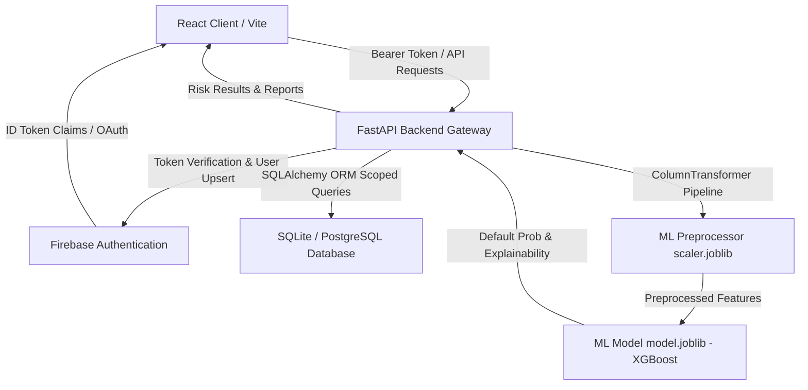

# MSME Risk AI: Alternative Credit Risk Intelligence

A production-grade, full-stack AI web application for predicting MSME (Micro, Small, and Medium Enterprises) loan default risk using alternative financial, transactional, and behavioural telemetry.

---

## 1. Problem Statement

Micro, Small, and Medium Enterprises (MSMEs) represent the backbone of global commerce. However, traditional credit bureaus often fail to score them accurately due to a lack of formal collateral and borrowing history (the "thin-file" problem). Underwriters need a data-driven framework that utilizes non-traditional data—including cash flow volatility, digital transaction velocity, utility and invoice payment reliability—to make objective, transparent credit decisions.

## 2. Solution

**MSME Risk AI** bridges this gap by gathering alternative operational indicators and applying a trained Machine Learning pipeline to predict loan default probabilities. The platform translates model outputs into clear risk tiers, Explainable AI decision drivers, positive credit signals, risk alerts, and exportable credit reports (JSON and printable PDF), facilitating transparent risk assessment for underwriting teams.

---

## 3. Technology Stack & Architecture



### Frontend
- **Framework**: React 18 with TypeScript (Vite bundler)
- **Routing & Guards**: React Router 6 with Firebase `onAuthStateChanged` private route gating
- **Authentication**: Firebase Authentication (Email/Password + Google OAuth)
- **Styling**: Vanilla CSS custom fintech dark-theme with full print media stylesheet (`@media print`)
- **Icons**: Lucide React

### Backend
- **Framework**: FastAPI (Python 3.11)
- **Server**: Uvicorn
- **Authentication**: Firebase Admin SDK Bearer Token Verification (`Authorization: Bearer <token>`)
- **ORM & Database**: SQLAlchemy (SQLite for development, PostgreSQL-ready)
- **Data Isolation**: Strict multi-tenant user scoping across all business, assessment, and report records

### Machine Learning & Explainable AI
- **Modeling**: Scikit-Learn (Logistic Regression, Random Forest, Decision Tree) & XGBoost Classifier
- **Preprocessing Pipeline**: `ColumnTransformer` (Median SimpleImputer + StandardScaler for numericals, Most-Frequent SimpleImputer + OneHotEncoder for categoricals)
- **Explainable AI (XAI)**: Dynamic multi-factor decomposition highlighting primary drivers, positive indicators, and critical risk flags
- **Artifact Versioning**: Serialized `model.joblib`, `scaler.joblib`, and `model_metadata.json`

---

## 4. Project Structure

```
msme-risk-ai/
├── frontend/
│   ├── src/
│   │   ├── components/       # Brand, Header, Sidebar, StatCard, LoadingSpinner, ErrorMessage
│   │   ├── pages/            # Home, Login, Register, Dashboard, Assessment, Prediction, Reports
│   │   ├── services/         # firebase.ts, api.ts (Bearer token client)
│   │   ├── App.tsx           # Router and PrivateRoute Guard
│   │   └── main.tsx
│   ├── package.json
│   ├── vite.config.ts
│   └── .env.example
│
├── backend/
│   ├── app/
│   │   ├── main.py           # FastAPI entry point & CORS configuration
│   │   ├── auth.py           # Firebase Bearer token verification & user upsert
│   │   ├── routes/           # health, prediction, assessment, reports endpoints
│   │   ├── schemas/          # Pydantic models (assessment, prediction schemas)
│   │   ├── database/         # SQLAlchemy engine, session, models (User, Business, Assessment, Prediction, Report)
│   │   ├── services/         # preprocessing, prediction_service, report_service
│   │   └── config.py         # Pydantic BaseSettings environment configuration
│   ├── ml/
│   │   ├── training/         # train.py (Synthetic data generation, multi-model evaluation, serialization)
│   │   ├── preprocessing/    # preprocess.py (ColumnTransformer & cleaning pipeline)
│   │   └── models/           # model.joblib, scaler.joblib, model_metadata.json
│   ├── tests/                # Comprehensive Pytest test suite (15 unit/integration tests)
│   │   ├── conftest.py       # Isolated test client & in-memory DB fixtures
│   │   ├── test_auth.py      # Bearer token validation & 401 tests
│   │   ├── test_prediction.py# Prediction endpoint & schema tests
│   │   ├── test_assessments.py# Multi-tenant data isolation & dashboard tests
│   │   ├── test_reports.py   # Report generation, authorization, and 403 checks
│   │   └── test_ml_pipeline.py# Preprocessing & Explainable AI logic tests
│   ├── requirements.txt
│   └── .env.example
│
├── data/
│   ├── raw/                  # msme_loans_raw.csv
│   └── processed/            # msme_loans_clean.csv & training_summary.json
│
├── README.md
└── .gitignore
```

---

## 5. Machine Learning Pipeline & Evaluation

The machine learning pipeline evaluates multiple algorithms on alternative financial indicators and selects the best model based on ROC-AUC:

### Evaluated Model Metrics

| Model | Accuracy | Precision | Recall | F1-Score | ROC-AUC |
| :--- | :--- | :--- | :--- | :--- | :--- |
| **XGBoost (Optimal)** | **91.80%** | **78.10%** | **82.00%** | **0.8000** | **0.9647** |
| **Random Forest** | 92.40% | 85.23% | 75.00% | 0.7979 | 0.9591 |
| **Logistic Regression** | 93.20% | 84.38% | 81.00% | 0.8265 | 0.9571 |
| **Decision Tree** | 91.60% | 79.00% | 79.00% | 0.7900 | 0.8990 |

- **Best Model Selected**: XGBoost Classifier (`model.joblib`)
- **Metadata**: Stored in `backend/ml/models/model_metadata.json` with hyperparameter and confusion matrix logs.

---

## 6. API Endpoints

All secure endpoints strictly require a valid Firebase ID token in the `Authorization` header (`Bearer <token>`).

| Method | Endpoint | Description | Auth Required |
| :--- | :--- | :--- | :--- |
| **GET** | `/api/health` | Service health status & DB connectivity | No |
| **POST** | `/api/predict` | Runs ML prediction, generates report & persists assessment | Yes (`Bearer <token>`) |
| **GET** | `/api/assessments` | Retrieves all assessments owned by current user | Yes (`Bearer <token>`) |
| **GET** | `/api/assessments/dashboard` | Aggregates user portfolio statistics & 7-day trend | Yes (`Bearer <token>`) |
| **GET** | `/api/assessments/{id}` | Fetches individual assessment detail (403 if unauthorized) | Yes (`Bearer <token>`) |
| **GET** | `/api/reports/{id}` | Fetches full credit assessment report (403 if unauthorized) | Yes (`Bearer <token>`) |

---

## 7. How to Run Locally

### Prerequisites
- Python 3.11+
- Node.js v18+

### 1. Run the Python Backend
From the repository root:
```bash
# Activate virtual environment
.\venv\Scripts\activate

# Install dependencies (if not already installed)
pip install -r backend/requirements.txt

# Run model training (optional, trained model already included)
python backend/ml/training/train.py

# Start the FastAPI backend server
python -m uvicorn backend.app.main:app --reload --port 8000
```
Backend API will be running at `http://localhost:8000` (API Docs: `http://localhost:8000/docs`).

### 2. Run the React Frontend
In a separate terminal:
```bash
cd frontend

# Install dependencies
npm install

# Start Vite dev server
npm run dev
```
Frontend application will be accessible at `http://localhost:5173`.

### 3. Run Automated Tests
```bash
# Execute the full pytest test suite
.\venv\Scripts\pytest.exe backend/tests -v
```

---

## 8. Disclaimer

*MSME Risk AI is an AI-powered credit risk decision-support system. It is designed to assist credit analysts and underwriting teams by analyzing non-traditional operational signals and default probability patterns. It does not constitute a guaranteed lending commitment, formal credit rating agency score, or financial advice.*
